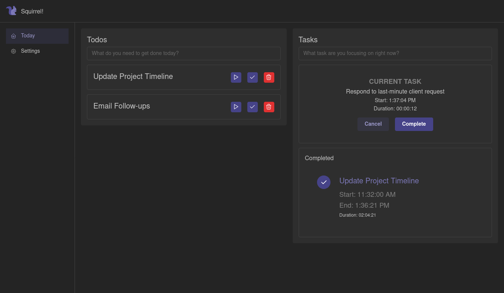

# Squirrel

  

https://common-gull.github.io/squirrel-time-tracking/

Welcome to Squirrel, a straightforward and efficient time tracking tool designed to help you manage your time
effectively. This application stores all your data locally, ensuring your information remains private and secure.

## Features

- **User-Friendly Interface**: Intuitive design for easy navigation and usage.
- **Local Data Storage**: Your data is stored on your device, providing enhanced privacy and security.
- **Time Tracking**: Effortlessly track the time spent on various tasks.

## License

This project is licensed under the [MIT License](LICENSE). Feel free to use, modify, and distribute the software as you
see fit.

## Contributing

We welcome contributions to Squirrel! If you have suggestions for improvements or new features, please open an issue or
submit a pull request.
